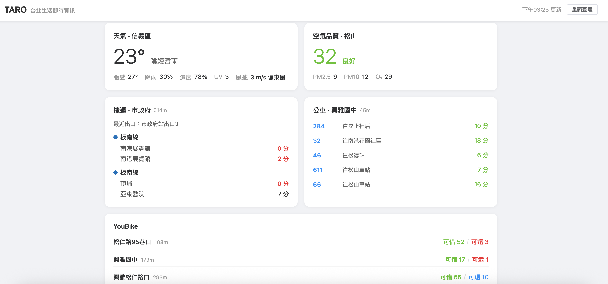

# TARO 台北生活即時資訊

TARO 是一個台北生活即時資訊儀表板，整合天氣、空氣品質、捷運、公車及 YouBike 等即時資訊，讓你一目了然掌握周遭交通與環境狀態。



## 功能

- **天氣資訊** — 即時溫度、體感溫度、降雨機率、濕度、UV 指數、風速
- **空氣品質** — AQI 指標、PM2.5、PM10、O₃ 數值
- **捷運到站時間** — 最近捷運站即時到站資訊
- **公車到站時間** — 附近公車站牌即時到站預估
- **YouBike 站點** — 鄰近站點可借可還數量

## 技術框架

| 類別 | 技術 |
|------|------|
| 前端框架 | [Vue 3](https://vuejs.org/) (Composition API + `<script setup>`) |
| 建置工具 | [Vite](https://vite.dev/) |
| UI 元件庫 | [Element Plus](https://element-plus.org/) |
| HTTP 請求 | [Axios](https://axios-http.com/) |
| 圖示 | [@element-plus/icons-vue](https://element-plus.org/en-US/component/icon.html) |

## 快速開始

```bash
# 安裝依賴
npm install

# 啟動開發伺服器
npm run dev

# 建置生產版本
npm run build
```
